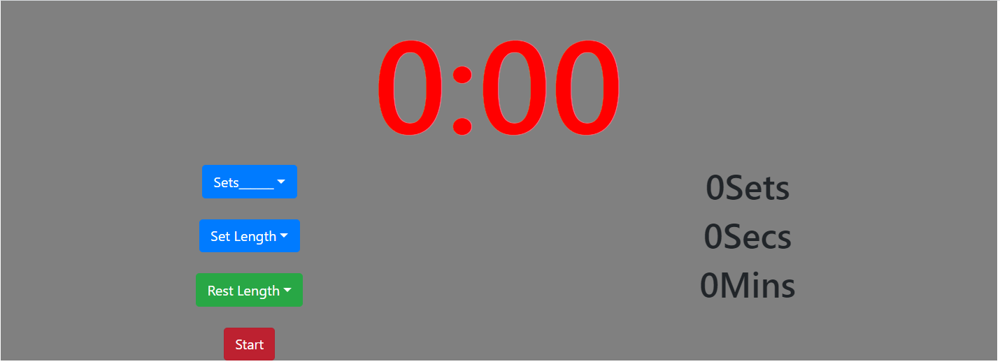

## HIIT Timer

 ## Description
 this is a simple HIIT timer written in react.js utilizing the react-bootstrap npm. it allows users to a set a number of sets(or workouts) to prefrom at high intensity for a certain amount of seconds, then starts a rest timer. typically the rest is 2 minutes but this can be adjusted by the user.

 note the number of sets is sets remaining so the timer will continue at 0 sets. 

## Table of Contents
* [intsallation](#Installation)
* [usage](#Usage)
* [Technology Utilized](#Technologies)
* [contributing](#Contributing)
* [Tests](#Tests)
* [User Story](#UserStory)
* [ScreenShot](#ScreenShot)
* [Github](#Github)

## Installation
This project is deployed on heroku otherwise this project reqires the user to npm install dependencies then run npm start inside the client portion of the command line after forking the repo

## Usage
this is used as a workout simple workout timer. 

## Technologies
react, react-bootstrap, node.js,  

## License
used the undefined license

## Contributing
Jacob LaMarre contributed to the design.

## Tests
try these test commands: try picking different number of sets to and times for the sets then start the timer. 

## UserStory
AS A Hiit cardio excersier
I WANT Timer
SO THAT time the workout sets and rest periods more easily.

## ScreenShot
screenshot here!!!!!s

## Github
profile:jacobtlamarre
email: jacobtlamarre@gmail.com